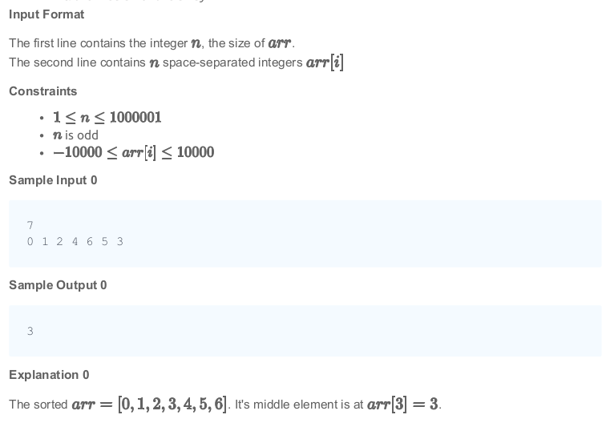

#### The median of a list of numbers is essentially its middle element after sorting. The same number of elements occur after it as before. Given a list of numbers with an odd number of elements, find the median?

#### Example
`arr = [5, 3, 1, 2, 4]`

The sorted array `arr = [1, 2, 3, 4, 5]`. The middle element and the median is <b>3</b>. 

#### Function Description
Complete the <i>findMedian</i> function in the editor below.

